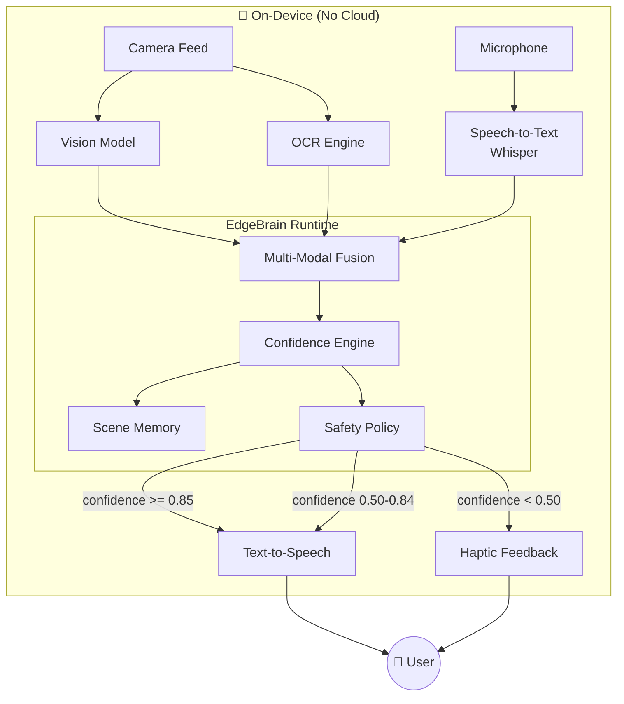
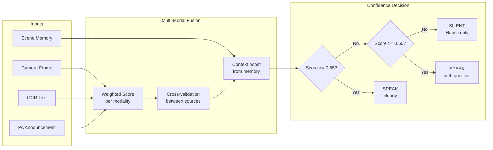
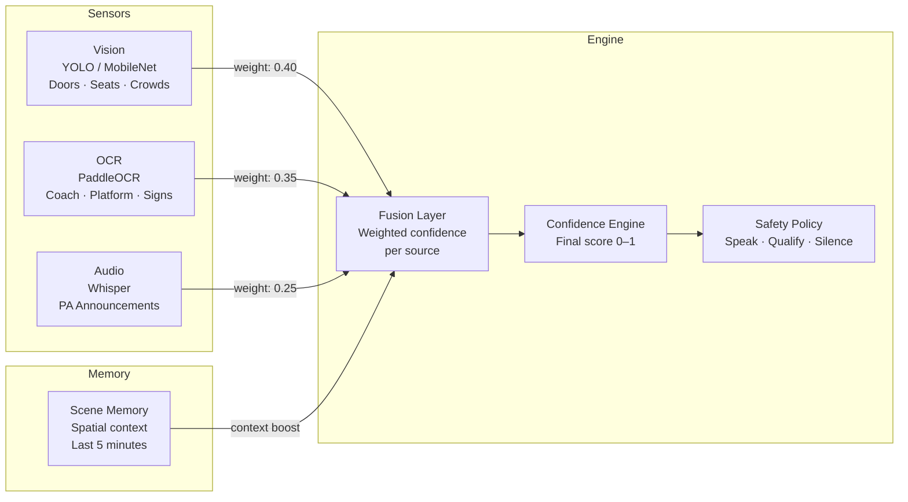
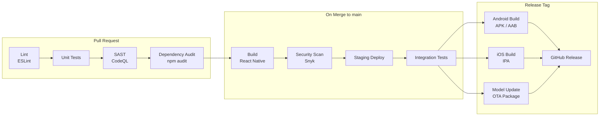
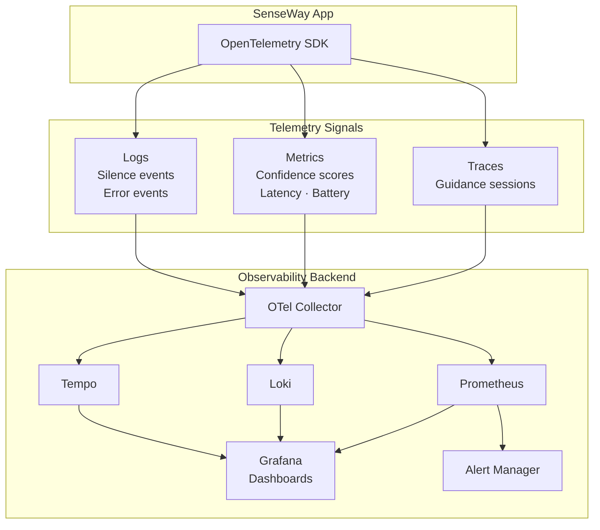
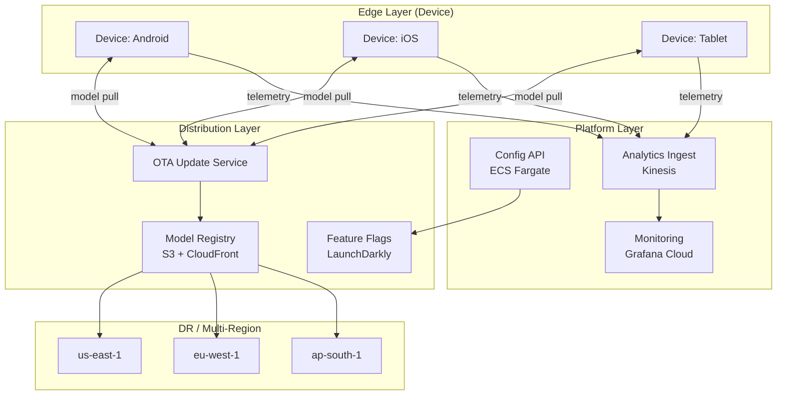

# SenseWay

**Confidence-aware AI navigation for blind and low-vision travelers.**

> *Silence is safer than a wrong instruction.*

SenseWay is an on-device, voice-first AI assistant that guides blind and low-vision passengers through public transit — trains, metros, buses, and stations — anywhere in the world. It fuses camera vision, OCR, and audio capture into a confidence engine that speaks only when it is certain, and stays silent when it is not.

[](https://github.com/venkonai/senseway/actions/workflows/ci.yml)
[](https://github.com/venkonai/senseway/actions/workflows/security.yml)
[](LICENSE)

---

## The Problem

Existing navigation apps for blind users share one critical flaw: **they always output an answer**, even when the AI is only 40% confident. In transit environments — noisy stations, moving trains, crowded platforms — a wrong instruction is not just unhelpful. It is dangerous.

SenseWay is built on a different contract with the user:

| Confidence | Action |
|---|---|
| High (≥ 85%) | Speak clearly |
| Medium (50–84%) | Speak with qualifier: *"possibly…"* |
| Low (< 50%) | **Stay silent** |

---

## System Architecture



---

## Confidence Engine



---

## Multi-Modal Sensor Fusion



---

## CI/CD Pipeline



---

## Observability Stack



Key metrics tracked:
- `senseway_confidence_score` — distribution of scores per session
- `senseway_silence_events_total` — how often AI stays silent (safety indicator)
- `senseway_guidance_latency_ms` — end-to-end response time
- `senseway_battery_impact_pct` — battery consumption per hour of use
- `senseway_ocr_accuracy` — OCR match rate against ground truth

---

## Scaling Architecture



### Scale targets

| Stage | Users | Strategy |
|---|---|---|
| MVP | 100 | Single region, manual deploys |
| Growth | 10,000 | CDN model distribution, auto-scaling API |
| Scale | 1,000,000 | Multi-region, canary model rollouts, edge caching |

---

## Screens

| Screen | Description |
|---|---|
| 01 · Home | Tap or say "Sense" to activate — pulsing orb voice visualizer |
| 02 · Real-time Guidance | Camera viewfinder with confidence-colored detection overlays |
| 03 · Announcement Capture | PA audio transcription + AI simplification |
| 04 · Shake to Describe | Instant scene snapshot on phone shake with haptic confirm |
| 05 · Scene Memory | Orbital spatial map of detected objects from last 5 minutes |
| 06 · Privacy & Safety | On-device guarantees — 0 images stored, 0 uploads, ever |
| 07 · New Journey | Reset scene memory between transit legs |
| 08 · Onboarding | 3-slide intro: Voice first · Confidence-aware · Yours alone |

---

## Key Design Decisions

See [`docs/adr/`](docs/adr/) for full Architecture Decision Records.

- **[ADR-001](docs/adr/001-confidence-first-design.md)** — Confidence-first silence over best-effort output
- **[ADR-002](docs/adr/002-on-device-only.md)** — On-device inference: no frames leave the phone
- **[ADR-003](docs/adr/003-multimodal-fusion.md)** — Multi-modal fusion over single-sensor input

---

## Roadmap

- [ ] React Native mobile app (Android + iOS)
- [ ] On-device vision model integration (YOLOv11 / MobileNet)
- [ ] On-device OCR (PaddleOCR)
- [ ] On-device speech (Whisper.cpp)
- [ ] EdgeBrain confidence engine integration
- [ ] Multi-language support (Hindi, Spanish, Japanese, French)
- [ ] OTA model update pipeline
- [ ] Prometheus + Grafana observability

---

## Repository Structure

```
senseway/
├── app/                        # UI prototype (React / JSX)
├── .github/
│   └── workflows/
│       ├── ci.yml              # Lint, test, security on PR
│       ├── security.yml        # SAST + dependency scan
│       └── release.yml         # Build + OTA model package on tag
├── docs/
│   ├── architecture.md         # Deep architecture detail
│   ├── scaling.md              # Scale from 100 → 1M users
│   ├── observability.md        # Metrics, traces, alerting
│   ├── security.md             # Threat model + controls
│   ├── deployment.md           # Deploy runbook
│   └── adr/                    # Architecture Decision Records
├── infra/                      # Terraform (coming)
└── README.md
```

---

## Part of VenKon AI

SenseWay is powered by [EdgeBrain](https://github.com/venkonai/edgebrain) — VenKon AI's trust-aware on-device AI runtime.

```
VenKon AI
├── senseway      ← You are here
├── edgebrain     ← On-device AI runtime
└── opspilot      ← AI for DevOps/SRE (coming)
```

---

## License

MIT © [VenKon AI](https://github.com/venkonai)
